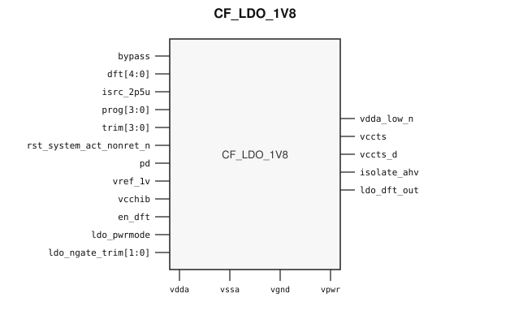

# CF_LDO_1V8

> 1.8 V LDO Regulator

The public GDS is an abstract; ChipFoundry
substitutes protected full geometry at tapeout.

This package ships an SRAM-style PG wrap `CF_LDO_1V8` around analog leaf
`CF_LDO_1V8_core`.

## Overview

`CF_LDO_1V8` is a SkyWater 130 nm hard-macro low-dropout regulator. Instantiate `CF_LDO_1V8`.

Macro size is 840 × 830 µm (15 µm halo around analog leaf 810 × 800 µm).
Customer PG for chip PDN is `vpwr` / `vgnd`. Analog supplies `vdda`, `vssa`,
and `vcchib` stay wrap ports and are routed as signals.

## Installation

```bash
pip install cf-ipm
ipm install CF_LDO_1V8 --version 0.2.0
```

Use `hdl/gl/CF_LDO_1V8.v` as the customer blackbox, `layout/lef/CF_LDO_1V8.lef`
for P&R, and `layout/gds/CF_LDO_1V8.gds` / `layout/mag/CF_LDO_1V8.mag` for the
public wrap. `CF_LDO_1V8_core` is the analog leaf (empty Verilog, pin-only
abstract). ChipFoundry substitutes vault GDS into `CF_LDO_1V8_core` at tapeout.
P&R uses the wrap LEF (`vpwr` / `vgnd` for chip PDN).

Functional sim compiles `verify/beh_model/CF_LDO_1V8_core.v` **instead of** the empty `hdl/gl/CF_LDO_1V8_core.v` stub. See `verify/beh_model/README.md`.

## Features

- Regulated outputs `vccts` and `vccts_d`
- Analog input `vdda`, analog ground `vssa`, and auxiliary supply `vcchib`
- Reference `vref_1v` and bias `isrc_2p5u`
- Power-down `pd`, bypass `bypass`, and reset `rst_system_act_nonret_n`
- Supply flag `vdda_low_n`, isolate `isolate_ahv`, and DFT output `ldo_dft_out`
- Controls `en_dft`, `ldo_pwrmode`, `dft[4:0]`, `prog[3:0]`, `trim[3:0]`, and `ldo_ngate_trim[1:0]`
- Ideal Verilog behavioral model under `verify/beh_model/` for functional sim
- Customer cell `CF_LDO_1V8` 840 × 830 µm (15 µm halo around analog leaf 810 × 800 µm)
- Chip PDN is `vpwr` / `vgnd`

## Pinout

Customer documentation includes a pinout of the integration cell only.
Internal schematics and architecture block diagrams are not published.



Pin names and directions match the public wrap (`layout/lef/CF_LDO_1V8.lef`)
and the blackbox stub (`hdl/gl/CF_LDO_1V8.v`).

## Pin Description

Directions and widths are taken from the shipped Verilog in `hdl/gl/CF_LDO_1V8.v`.

| Name | Direction | Width | Description |
|---|---|---:|---|
| `vdda_low_n` | output | 1 | High when the analog supply is present in the ideal model. |
| `vccts` | output | 1 | Regulated output. |
| `vccts_d` | output | 1 | Second regulated output. |
| `bypass` | input | 1 | Bypass. High makes the outputs follow `vdda` in the ideal model. |
| `dft` | input | 5 | DFT controls. |
| `isrc_2p5u` | input | 1 | Bias current. Route as a signal; not on chip PDN. |
| `prog` | input | 4 | Program code. |
| `trim` | input | 4 | Trim code. |
| `rst_system_act_nonret_n` | input | 1 | Active-low reset. Low clears the outputs in the ideal model. |
| `vdda` | input | 1 | Analog supply. Route as a signal; not on chip PDN. |
| `pd` | input | 1 | Power-down. |
| `vref_1v` | input | 1 | Reference. Route as a signal; not on chip PDN. |
| `vssa` | input | 1 | Analog ground. Route as a signal; not on chip PDN. |
| `vpwr` | input | 1 | Digital supply. |
| `vgnd` | input | 1 | Ground. |
| `vcchib` | input | 1 | Auxiliary supply. Route as a signal; not on chip PDN. |
| `en_dft` | input | 1 | DFT enable. |
| `isolate_ahv` | output | 1 | Isolate flag. |
| `ldo_dft_out` | output | 1 | DFT observe. |
| `ldo_pwrmode` | input | 1 | Power mode. |
| `ldo_ngate_trim` | input | 2 | Output-device trim. |

`CF_LDO_1V8_core` uses `vccd` and `vssd` for the same digital rails. The wrap
ties `.vccd(vpwr)` and `.vssd(vgnd)`. Do not connect those pins at chip level.

In OpenLane / LibreLane, hook chip PDN with
`PDN_MACRO_CONNECTIONS: "u_cf_ldo_1v8 vccd1 vssd1 vpwr vgnd"` and connect
`.vpwr(vccd1)`, `.vgnd(vssd1)` under `USE_POWER_PINS`. Route `vdda`, `vssa`,
`vcchib`, `vccts`, `vccts_d`, `vref_1v`, and `isrc_2p5u` onto `analog_io`.

## Specifications

This regulator is the catalog 1.8 V LDO. No Liberty timing file ships with
this package. This README does not invent PVT tables.

## Timing Diagram

The ideal model in `verify/beh_model/` is the functional timing reference for
simulation. `pd` high, or `rst_system_act_nonret_n` low, clears the outputs.
With those released, `vdda_low_n` follows `vdda`, and `vccts` / `vccts_d` are
high when `vdda` and `vref_1v` are high. That model is not silicon-verified.

## Limitations and Open Issues

- Verilog in `hdl/gl/CF_LDO_1V8.v` is a structural wrap around an empty
  `CF_LDO_1V8_core` blackbox. Functional sim uses `verify/beh_model/CF_LDO_1V8_core.v` (ideal model, not SPICE).
- Liberty is not in this package. P&R uses the wrap LEF.
- Trim, program, power-mode, bias, and auxiliary-supply behavior are not modeled.

## Release History

| Version | Date | Notes |
|---|---|---|
| 0.2.0 | 2026-09-26 | First SRAM-style PG-wrapped package. Ideal behavioral model. Core fill-exclude covers. |

## Tapeout History

This hard macro has high-volume commercial production history (millions of
units). Catalog and IPM maturity is Production. ChipFoundry substitutes
protected full layout at tapeout. The chipIgnite delivery of this package is
not marked shuttle-proven until a run returns.
